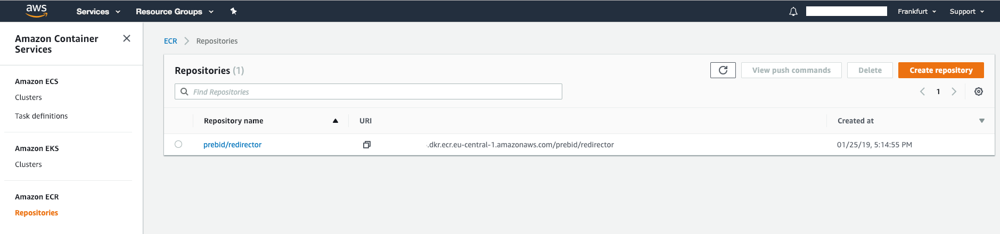
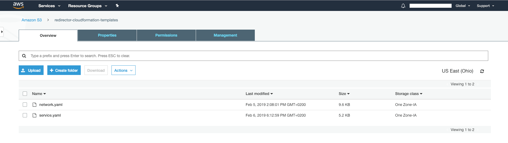
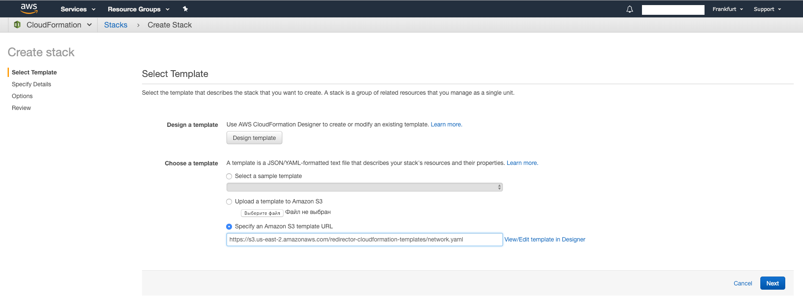
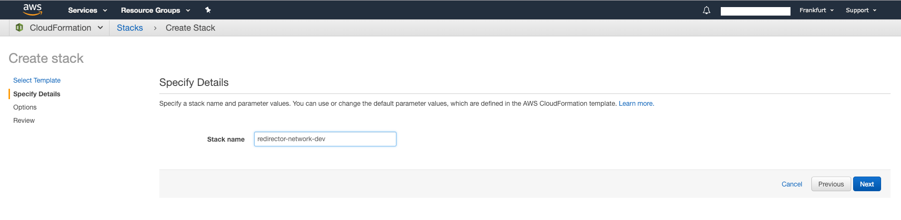
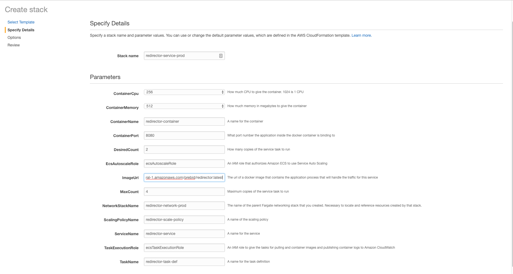
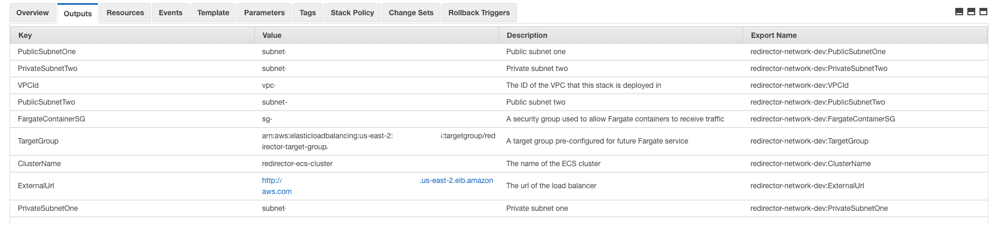
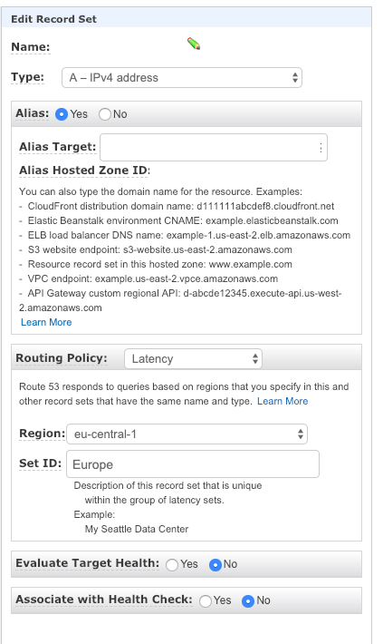

# Prebid Video Cache Redirector

## General overview
Purpose of this application - allow to overcome the limitation (or rather a security feature) of [Google Ad Manager](https://admanager.google.com/home/) 
prohibiting publishers to have macros in the host name part of a VAST tag URL.

With this service running, for example at `cache.prebid.org`, the publisher would be able to enter a constant VAST tag 
URL like `https://cache.prebid.org/redir?host=%%PATTERN:hb_cachehost%%&uuid=%%PATTERN:hb_uuid%%`. The service will 
redirect the video player to the appropriate place, e.g. `prebid.adnxs.com/pbc/v1/cache` or 
`prebid-server.rubiconproject.com/cache`.

In order to prevent misuse of this service it validates requested redirect host key against configured list of allowed 
redirect locations (see [configuration](#configuration) section).

## Endpoints description
The application provides following endpoints:

##### GET /redir
* Responds with `302` code and `Location` header with the URL of corresponding redirect location
* Responds with `404` code if host specified in `host` query parameter is not configured in the application
* Responds with `400` if `host` and/or `uuid` query parameters are missing in request

Example: In response to `GET /redir?host=prebid-server.rubiconproject.com&uuid=123` request following response is returned:
```
HTTP/1.1 302 Found
location: https://prebid-server.rubiconproject.com/cache?uuid=123
```

##### GET /health
Always responds with `200` code. This is to support application health monitoring by load-balancer.

## Build instructions
To build the project, you will need at least
[Java 8 JDK](http://www.oracle.com/technetwork/java/javase/downloads/index.html)
and [Maven](https://maven.apache.org/) installed.

Follow next steps to create fat-JAR which could be run locally. 

Download or clone a project:
```
git clone https://github.com/prebid/prebid-video-cache-redirector.git
```

Navigate to the project directory:
```
cd prebid-video-cache-redirector
```

Run the following command to build the project:
```
mvn clean package
```

## Run instructions
Run the following command to launch the application:
```
java -jar target/prebid-video-cache-redirector.jar -conf src/main/config/config.json
```

The application will listen on port 8080 by default. This could be changed in [configuration](src/main/config/config.json).

## Packaging instructions
This project allows to package the application in the Docker image out-of-the-box. Run the 
following command to build an image (you will need [Docker](https://www.docker.com/) installed of course):
```
mvn docker:build
```

This will build an image locally and tag it with `latest` and `${project.version}` (where `${project.version}` is a 
version of the application as specified in [pom.xml](pom.xml) file).

## Configuration
Application configuration is located at [config.json](src/main/config/config.json) file. Supported configuration properties:
- `http.port` - port on which application will be listening for incoming connections
- `redirect.mapping` - this is the most important piece of configuration as it defines allowed redirect locations

Configuration file is packaged in the docker image along with the application so adding/changing hosts requires new image 
creation and redeployment. If you opt out from using docker image as deployment unit then change to the configuration doesn't 
require a new build since configuration is provided to the application externally.

## Deployment instructions
Redirector is designed to be deployment-agnostic. Since [prebid.org](http://prebid.org) is running in AWS and Redirector 
is considered as a service running on a subdomain [cache.prebid.org](http://cache.prebid.org) primary target for it will be
AWS as well.

Rest of this section dedicated to specifics of Redirector deployment to [AWS Fargate](https://aws.amazon.com/fargate/).

In order to get the application running in AWS Fargate you will need:
- Create an [AWS ECR](https://aws.amazon.com/ecr/) repository in single region of choice
- Push an application image to the ECR repository
- Create the stack of necessary AWS resources to set up and run the application in as many regions as needed
- Set up [AWS Route 53](https://aws.amazon.com/route53/) to route client requests to the closest data centers

These step are discussed in details in the following subsections.

### Create ECR repository
[Create ECR repository](https://docs.aws.amazon.com/AmazonECR/latest/userguide/repository-create.html) named 
`prebid/redirector` (it is the name of the docker image that the build creates). You will need only one ECR 
repository regardless of the number of regions where Redirector will be running.



When repository is created note the name of the repository in form 
`<aws_account_id>.dkr.ecr.<aws_region>.amazonaws.com/prebid/redirector`. It will be needed during next steps.

### Push image to ECR repository
Given that the application image is already generated locally and ECR repository exists it's time to push it to the 
repository to make it available for deployment.

In order to be able to push to repository you must log in into it first. There are two options:
- Generate and run `docker login` command using `aws ecr get-login` as described in 
[mentioned document](https://docs.aws.amazon.com/AmazonECR/latest/userguide/repository-create.html)
- Delegate this procedure to [maven docker plugin](http://dmp.fabric8.io/#extended-authentication). In this case you 
will have to provide AWS access key ID and secret access key to the maven command (see below)

If you have chosen the first option run the following commands:
```
$(aws ecr get-login --no-include-email)
mvn -Ddocker.push.registry=<aws_account_id>.dkr.ecr.<aws_region>.amazonaws.com docker:push
```

If you have chosen the second option run the following command:
```
mvn -Ddocker.push.registry=<aws_account_id>.dkr.ecr.<aws_region>.amazonaws.com -Ddocker.push.username=<aws_access_key_id> -Ddocker.push.password=<aws_secret_access_key> docker:push
```

After this step you should be able to see the image in ECR in AWS Console.

 ### Create AWS resources and deploy application
In order to get application deployed to [AWS ECS](https://aws.amazon.com/ecs/) using Fargate many different 
AWS-specific resources should be created, most important among them: VPC, Subnets, Application Load Balancer, ECS cluster, 
ECS Task Definition and ECS Service.

This project contains [AWS CloudFormation](https://aws.amazon.com/cloudformation/) templates allowing to create all these 
resource easily with a few clicks. These templates are located in [cloudformation](cloudformation) directory.

In order to start the process of resources creation using these templates they should be stored in S3 bucket first. You 
may do this manually or let AWS do this for you, in the latter case a new S3 bucket will be created with a generated name 
and the templates will be uploaded in it under the covers and that will happen in each region where you will create a stack.
If you do this manually though only one S3 bucket will be needed, perhaps in the same region where ECR repository has 
been created, but that is optional. It will be assumed further that a S3 bucket was created manually and templates were 
uploaded in it beforehand.



All the resources are broken into two groups. [First group](cloudformation/network.yaml) contains all the network 
resources (VPC, Subnets, ALB) and ECS Cluster. [Second group](cloudformation/service.yaml) contains ECS Task Definition 
and Service.

At first create the network stack:
- Initiate CloudFormation stack creation

- Pick a decent name for the stack, for example `redirector-network-prod`

- Wait until all the resources are provisioned

After that create the service stack:
- Initiate CloudFormation stack creation
- Pick a decent name for the stack, for example `redirector-service-prod`
- Fill in desired input parameters, most notable and important of them are:
  - Image URL - specify ECR repository name and tag to deploy, for example `<aws_account_id>.dkr.ecr.<aws_region>.amazonaws.com/prebid/redirector:latest`
  - Network Stack Name - specify the name of the network stack created previously, for example `redirector-network-prod`
  - Task Execution Role - specify the name of existing [task execution role](https://docs.aws.amazon.com/AmazonECS/latest/developerguide/task_execution_IAM_role.html)
  - ECS Autoscale Role - specify the name of existing [ECS autoscale role](https://docs.aws.amazon.com/AmazonECS/latest/developerguide/autoscale_IAM_role.html)

- Wait until all the resources are provisioned

Once both stacks are created application should be up and running, it could be accessed by ALB DNS name that is found on 
the Outputs tab of the network stack as `ExternalUrl`:

```
curl -v "http://<alb_name>.<aws_region>.elb.amazonaws.com/redir?host=prebid-server.rubiconproject.com&uuid=123"
*   Trying 1.2.3.4...
* TCP_NODELAY set
* Connected to <alb_name>.<aws_region>.elb.amazonaws.com (1.2.3.4) port 80 (#0)
> GET /redir?host=prebid-server.rubiconproject.com&uuid=123 HTTP/1.1
> Host: <alb_name>.<aws_region>.elb.amazonaws.com
> User-Agent: curl/7.54.0
> Accept: */*
>
< HTTP/1.1 302 Found
< Date: Wed, 06 Feb 2019 16:17:50 GMT
< Content-Length: 0
< Connection: keep-alive
< location: https://prebid-server.rubiconproject.com/cache?uuid=123
<
* Connection #0 to host <alb_name>.<aws_region>.elb.amazonaws.com left intact
```

Repeat network and service stacks creation in other regions as needed.

### Set up subdomain
AWS Route 53 allows to set up subdomain so that the users receive IP addresses to access the application in the nearest 
data center based on user's latency to data centers where application is running.

In order to use [latency based routing policy](https://docs.aws.amazon.com/Route53/latest/DeveloperGuide/routing-policy.html#routing-policy-latency) 
for the subdomain you'll have to create a separate Record Set for each region in which you have the application running. 
See [documentation](https://docs.aws.amazon.com/Route53/latest/DeveloperGuide/resource-record-sets-values-latency-alias.html) 
for further details.


### Application redeployment
To keep things simple it is advised to confine to using only one image tag `latest`. In this case getting updated version 
of the application deployed boils down to:
- building and pushing a new version of the docker image to the ECR repository
- stopping ECS tasks in each region (but not all at once)
- ECS will start new tasks in place of stopped ones and they will pull the image of the latest version under `latest` tag